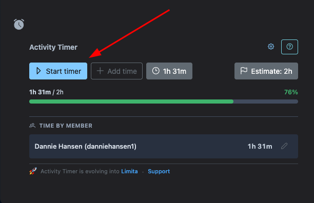
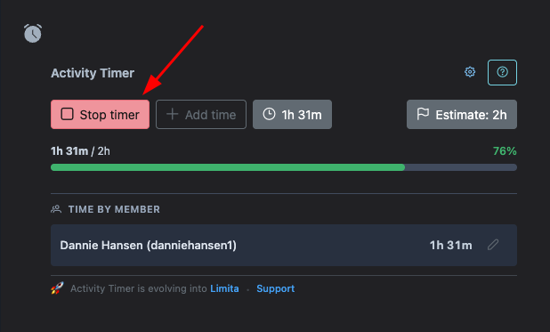
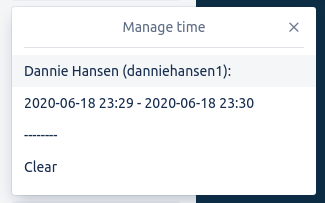
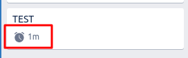
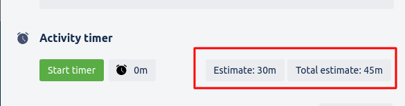
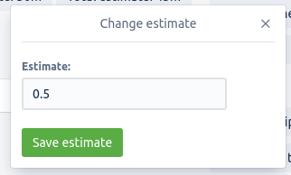
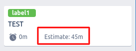
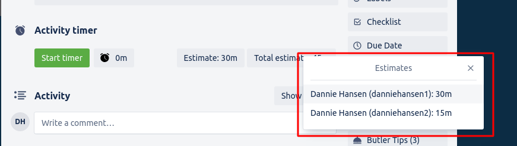
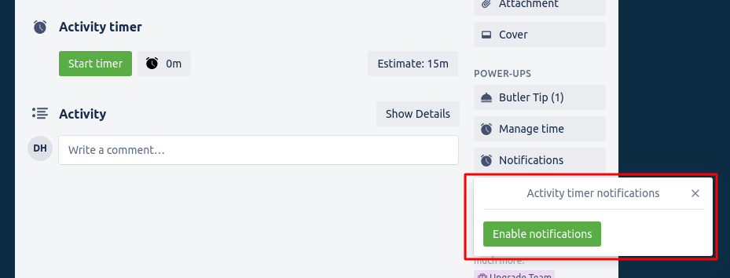
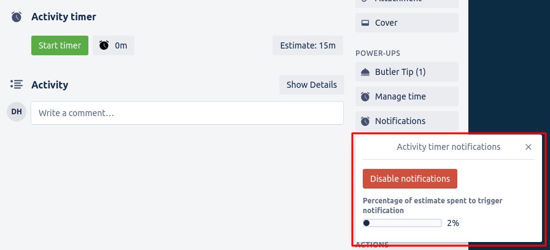

# Looking for new maintainer
Activity timer has been a passion project of mine for a number of years. However, as of late i have had little to no motivation moving the project forward. I've simply had too much happening privately to progressively make Activity timer better.

For this reason I'm looking for a new maintainer. If you're open to continue maintaining Activity timer, and developer new functionality - please reach out.

# Activity timer

Time is precious, this we know. Keeping track of this precious time is hard. Activity timer solves just that! With Activity timer you can now keep track on your time spent working with cards.

## Explained

To start tracking your time you need to manually start timer. This you do up top of your card as simple as clicking "Start timer". Once timer has started you will be able to see total time spent right next to the button you clicked. 

Once timer has started "Start timer" will switch over to a "Stop timer" button. Clicking this will stop the timer and register your time slot in the logs.

At any given time you can in the card "Power-ups" section manage time and even see a list over time spent by every team member for this card.

In addition to this you'll be able to quickly peak at the total time spent for a card when viewing the board.

Activity timer also provides you with the ability to put estimates on your cards.

Clicking the estimate box will show a popup where you can create/update your estimate.

Once an estimate have been saved it will show on the board view & also when on the card. If multiple members have set an estimate another box will appear with the total estimate across members. Clicking this will open a popup showing which member estimated what on the task. Very useful for when members collaborate on the same cards.

Next up there are notifications! Notification allows you to get notified after spent x percent of your estimated time. Allowing you to react quickly to any drift in estimates.

## Highlights

1. Easy access to start / stop of timer.
2. Powerful time management editor to edit previous recordings.
3. When you move card from one list to another it will automatically stop the timer.
4. All data on a card is stored in a compressed format that's easy to access through REST API.
5. Estimation functionality.
6. Desktop notifications when nearing estimate.
7. **(Premium)** Exporting tool for exporting powerup data into CSV. This powerful tool allows you to filter Activity timer trackings and control which columns to include in the CSV.

## Card data (REST API)

Want to extract logged time and process it in another system? No problem! Activity timer keeps recordings in the shared data of the card. This means you can query the logged time for a card using Trello's own REST API. All the time ranges saved by Activity timer is saved within key `act-timer-ranges` in shared card data. `act-timer-ranges` consists of an array where each item's index equals to:

- 0: Member id
- 1: Start time (unix timestamp)
- 2: End time (unix timestamp)

## Docs
You can read more about the internals of Activity timer in [our docs](docs/README.md). This will walk you through the infrastructure as well as how to setup the local development workspace.