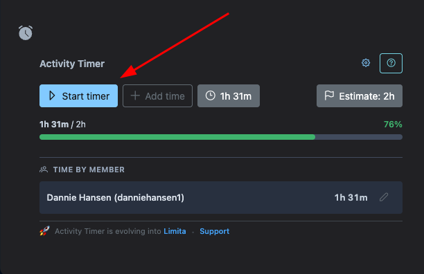
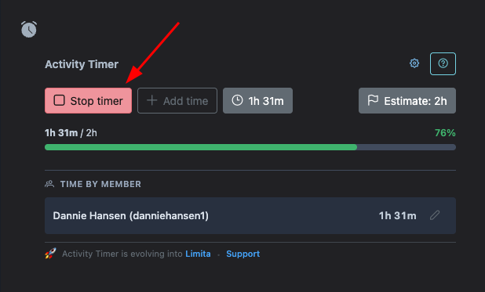
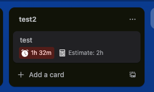
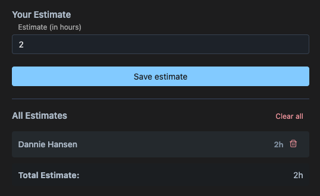

# Activity Timer - Time Tracking Built Into Trello

**Trusted by 27,000+ teams worldwide.** Activity Timer is a Trello Power-Up that eliminates context-switching by bringing time tracking directly into your Trello cards. Track time spent on work, set estimates, receive smart notifications, and export comprehensive reports - all without leaving Trello.

### ⚡ What Activity Timer Does:
- ⏱️ **One-Click Time Tracking** - Start/stop timers directly on Trello cards
- 🎯 **Time Estimation** - Set individual or team estimates and track progress
- 🔔 **Smart Notifications** - Get alerted when approaching estimate thresholds
- 👥 **Team Visibility** - See time spent by all members on shared cards
- 📊 **Data Export** - Export time tracking data to CSV with advanced filtering
- 📅 **Calendar View** - Visualize your week of time tracking
- 🔌 **API Access** - All data stored in Trello's native storage, accessible via REST API

**Open source, privacy-first, and actively maintained.**

---

## ⚡ Quick Start

Track time with one click. Simply open any Trello card and click **"Start timer"** in the Activity Timer section. Your time spent appears in real-time next to the button.



Click **"Stop timer"** to end your tracking session and automatically log the time range.



### 📊 Powerful Time Management

Access comprehensive time management tools through the Activity Timer section on any card. View detailed breakdowns of time spent by every team member, manually add time entries for past work, edit existing trackings, or clear data as needed. All changes are instantly visible to your entire team.

### 👀 Board-Level Visibility

See total time spent on any card directly from the board view - no need to open individual cards.



### 🎯 Smart Estimation & Progress Tracking

Set time estimates for realistic planning and progress tracking. Each team member can set their own estimate, and Activity Timer automatically calculates team totals.



Estimates display prominently on both board and card views with visual progress bars showing how actual time compares to your estimates. When multiple team members set estimates, you can view the combined total as well as individual breakdowns - perfect for collaborative work. Update estimates anytime as project scope evolves.

### 🔔 Intelligent Notifications

Stay ahead of scope creep with smart notifications. Configure custom thresholds to receive desktop alerts when you've spent a specific percentage of your estimated time (e.g., get notified at 80% or 90%). Enable notifications per-card to focus on your most important work, and react quickly to any drift in estimates before it becomes a problem.

## ✨ Key Features

### ⏱️ Time Tracking
- **One-click start/stop** - Click "Start timer" on any card to begin tracking
- **Automatic stop on card move** - Optionally stop timers when moving cards between lists
- **Manual time entry** - Add time entries manually for past work
- **Edit time entries** - Modify or delete existing time trackings
- **Real-time display** - See time accumulate live as you work
- **Team visibility** - View time spent by all members on shared cards
- **Minimum duration threshold** - Prevent accidental short entries (configurable)

### 🎯 Estimation & Progress
- **Per-member estimates** - Each team member can set their own time estimate
- **Team estimate totals** - View combined estimates across all members
- **Visual progress bars** - See at-a-glance how actual time compares to estimates
- **Percentage indicators** - Know exactly how much of your estimate is used
- **Board-level badges** - See time and estimates directly on cards in board view
- **Estimate management** - Update or remove estimates anytime

### 🔔 Smart Notifications
- **Custom thresholds** - Set alerts at your preferred percentage (e.g., 80% of estimate)
- **Desktop notifications** - Native browser alerts when you approach time limits
- **Proactive alerts** - Catch scope creep before it becomes a problem

### 📊 Data & Export (Premium)
- **CSV export** - Export all time tracking data with advanced filtering
- **Filter by members** - Focus on specific team members
- **Filter by lists** - Export data from specific Trello lists
- **Filter by labels** - Export based on card labels
- **Date range selection** - Choose custom time periods
- **Custom column selection** - Include only the data you need
- **Week calendar view** - Visualize all time entries in a calendar format

### 🔌 Developer Features
- **REST API access** - All data stored in Trello's native storage via plugin data
- **Compressed format** - Efficient array structure maximizes Trello's 4KB limit
- **No external database** - Everything lives in Trello for simplicity and security
- **Open source** - Full codebase available on GitHub
- **Well documented** - Comprehensive technical documentation

## 🔌 API Access & Data Structure

**Built for integration.** Activity Timer stores all time tracking data directly in Trello's native storage, making it accessible through Trello's REST API. Perfect for building custom reports, integrating with other systems, or migrating to new platforms.

### Data Structure

All time ranges are stored under the key `act-timer-ranges` in the card's shared data. Each entry is a compact array:

```javascript
[
  ["memberId", startTimestamp, endTimestamp],
  ["5f1a2b3c4d5e6f7a8b9c0d1e", 1633024800, 1633028400],  // Example: 1 hour session
  ["5f1a2b3c4d5e6f7a8b9c0d1e", 1633032000, 1633035600]   // Another session
]
```

**Array indices:**
- `[0]` - Trello member ID
- `[1]` - Start time (Unix timestamp)
- `[2]` - End time (Unix timestamp)

Access via Trello REST API: `GET /1/cards/{cardId}/pluginData`

---

## 📚 Documentation & Development

Want to contribute or set up a local development environment? Check out our comprehensive technical documentation:

- **[Technical Overview](https://github.com/danniehansen/activity-timer/blob/master/AGENT.md)** - Architecture, data models, and system design

---

## 🚀 Why Teams Choose Activity Timer

* ✅ **Zero context switching** - Track time without leaving Trello
* ✅ **Trusted by 27,000+ teams** - Proven reliability since 2020
* ✅ **Open source** - Full transparency, [view the code on GitHub](https://github.com/danniehansen/activity-timer)
* ✅ **Privacy-first** - Your data stays in Trello's secure storage
* ✅ **No external database** - Simple architecture, no additional services to maintain
* ✅ **Free core features** - Essential time tracking at no cost
* ✅ **Developer-friendly** - REST API access and comprehensive documentation
* ✅ **Active maintenance** - Regular updates and responsive support

---

## 📄 License & Support

Activity Timer is open source and free to use. Licensed under [MIT](https://github.com/danniehansen/activity-timer/blob/master/LICENSE).

- **GitHub Issues** - [Report bugs or request features](https://github.com/danniehansen/activity-timer/issues)
- **Documentation** - Comprehensive guides in the [docs folder](https://github.com/danniehansen/activity-timer/tree/master/docs)
- **Community** - Join 27,000+ teams using Activity Timer
